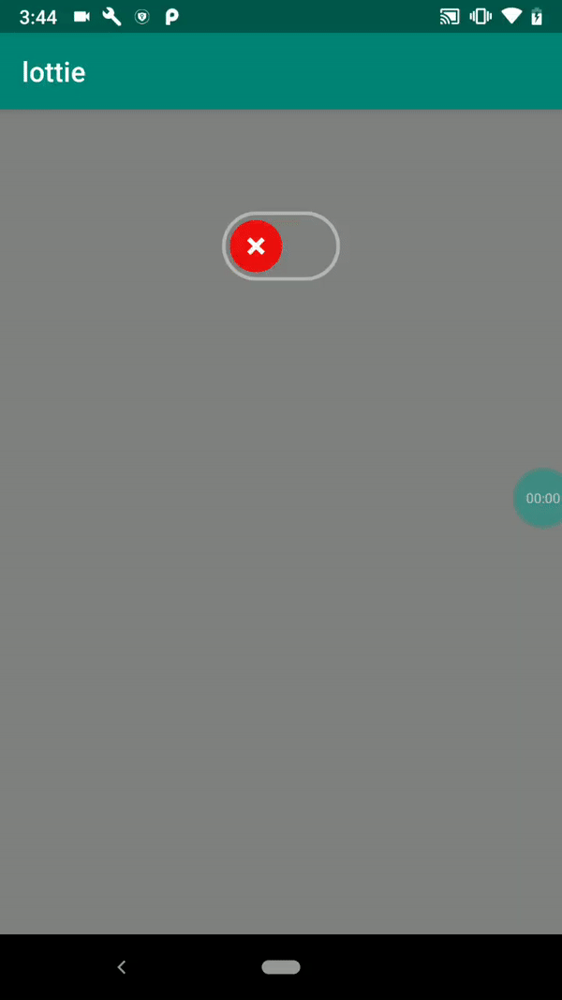

Sample project of integrating json file of this animation using Lottie Android
https://lottiefiles.com/24-toggle-switch

Toggle switch is functional, For every JSON file all you have to observe positions where you want to pause, like I have to pause at ON state, after observing set values in listener.

mail me if any problem occurs in integrating any json file.
shahzainali93@gmail.com

